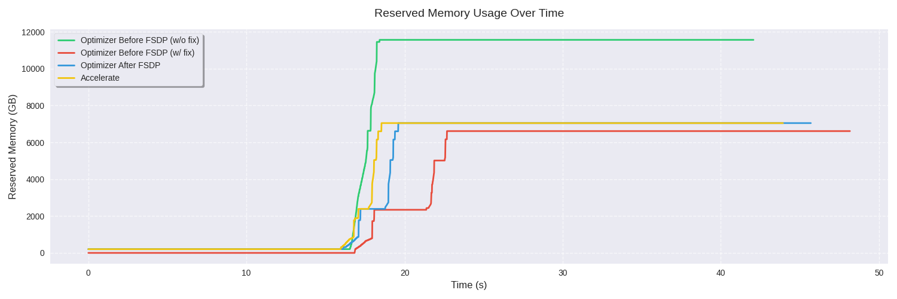

# FSDP2 Benchmarks

This benchmark showcases `FSDP2` in `Accelerate` and compares it to `torch` baseline.

## Overview

This benchmark consists of two parts:
- `main.py` is the main script that runs the benchmark
- `visualize.py` is the script that visualizes the results

## Motivation

We want to showcase that `Accelerate`'s integration of `FSDP2` is on par with `torch`'s baseline, even though in `torch` creating optimizer before applying `FSDP2` doesn't result in a working training loop.
This script showcases matching memory usage and convergence between `Accelerate` and `torch`'s baseline.

However, in `Accelerate` we had to come up with a workaround, because our approach to different distributed strategies is, that user brings their own optimizer, model, etc. and we prepare it for the them. This lead to an issue, because if user creates optimizer before applying `FSDP2`, it won't work.

So, we came up with a workaround, where we apply our own fix to the optimizer, basically replacing its parameters with the sharded ones. More about this can be found in this [blog post](TODO)

> [!NOTE]
> This script is intended to fit on 2x 24GB GPUs, though on so few GPUs it's not possible to see the memory difference (discrepancies in grad allocation result in lower memory usage in the non-fixed case), only the difference in convergence. Below are attached results from 8x H100 GPUs where the difference is visible.
> TLDR: more GPUs = bigger memory difference between fixed and non-fixed cases.

## Results

Here are the results from running the benchmark on 8x H100 GPUs:

<p align="center">
  
</p>
<p align="center">
  
</p>

As you can see, the memory usage of `Accelerate` and `torch_post_shard` (the intended way) are very similar, while `torch_pre_shard_not_fixed` uses significantly more memory. Our fix in `torch_pre_shard_fixed` brings the memory usage back in line with the intended approach.

> [!NOTE]
> Timing discrepancies are due to the benchmarks being ran in 1 script.


## Running

To run the benchmark, use the following command:

```bash
accelerate launch main.py
```

This supports multiple configurable options, you can learn about them by running:
```bash
python3 main.py --help
```

This script will run 4 different benchmarks:
- `torch_post_shard`: `torch` baseline where optimizer is created after applying `FSDP2`, this is the intended way to do it
- `torch_pre_shard_not_fixed`: `torch` baseline where optimizer is created before applying `FSDP2`
- `torch_pre_shard_fixed`: `torch` baseline where optimizer is created before applying `FSDP2` but we apply our fix to the optimizer
- `accelerate`: `Accelerate`'s own integration of `FSDP2` where optimizer is created before applying `FSDP2`, but we apply our fix to the optimizer

Memory results are saved in a folder specified by `--output_dir` argument.
Optionally, you can specify `--save_memory_snapshot` to save the torch memory snapshot, which can then be viewed using [`torch memory viz`](https://pytorch.org/memory_viz)

## Visualizing results

To visualize the results, you can run:

```bash
python3 visualize.py --dir <path_to_output_dir>
```

This will then create two plots, showcasing allocated and reserved memory usage between all the different benchmarks discussed above.


