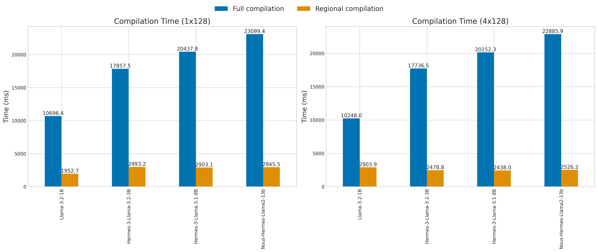
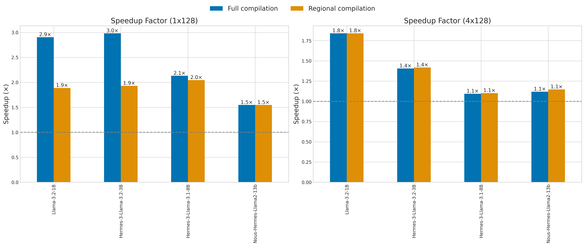

# Regional Compilation Benchmark

This benchmark compares different compilation strategies using PyTorch's `torch.compile` and Accelerate's `compile_regions` utility, which is based on the recipe in [PyTorch documentation](https://pytorch.org/tutorials/recipes/regional_compilation.html).

## Overview

The benchmark evaluates three approaches:

- **Baseline**: No compilation, standard PyTorch eager execution.
- **Full compilation**: Using PyTorch's `torch.compile()` on the entire model.
- **Regional compilation**: Using `accelerate.utils.compile_regions()` which targets specific blocks of the model to optimize compilation time.

Each approach is tested with different batch sizes (1 and 4) and sequence lengths (128) on various LLaMA-based models ranging from 1B to 13B parameters. We purposefully run the forward pass outside of the `torch.no_grad()` context to simulate performance in a training environment, where gradients are needed.

## Usage

To run this benchmark:

```bash
python regional_compilation.py
```

The script will automatically download the model configurations, create models, and benchmark both compilation and inference times across different scenarios.

## Requirements

- Suitable GPU memory for the models being tested.
- PyTorch with CUDA support.
- Transformers library.
- Accelerate library.

## Results

The benchmark results are summarized in the following figures:

- Compilation time is how long it takes to run the first forward pass.
- Speedup factor is the ratio of non-compiled baseline inference time to the fully/regionally compiled inference time.

<p align="center">
  
</p>
<p align="center">
  
</p>

Full results are available in the tables below:

```markdown
[-------------------------------------------------- NousResearch/Llama-3.2-1B ---------------------------------------------------]
                            |  Inference time (1x128)  |  Inference time (4x128)  |  Compile time (1x128)  |  Compile time (4x128)
1 threads: -----------------------------------------------------------------------------------------------------------------------
      Baseline              |           18.3           |           18.4           |                        |                      
      Full compilation      |            6.3           |           10.0           |        10696.4         |        10248.0       
      Regional compilation  |            9.7           |           10.0           |         1952.7         |         2903.9       

Times are in milliseconds (ms).

[---------------------------------------------- NousResearch/Hermes-3-Llama-3.2-3B ----------------------------------------------]
                            |  Inference time (1x128)  |  Inference time (4x128)  |  Compile time (1x128)  |  Compile time (4x128)
1 threads: -----------------------------------------------------------------------------------------------------------------------
      Baseline              |           33.4           |           33.6           |                        |                      
      Full compilation      |           11.2           |           23.9           |        17857.5         |        17736.5       
      Regional compilation  |           17.3           |           23.7           |         2993.2         |         2478.8       

Times are in milliseconds (ms).

[---------------------------------------------- NousResearch/Hermes-3-Llama-3.1-8B ----------------------------------------------]
                            |  Inference time (1x128)  |  Inference time (4x128)  |  Compile time (1x128)  |  Compile time (4x128)
1 threads: -----------------------------------------------------------------------------------------------------------------------
      Baseline              |           40.3           |           59.5           |                        |                      
      Full compilation      |           18.9           |           54.4           |        20437.8         |        20152.3       
      Regional compilation  |           19.7           |           54.0           |         2903.1         |         2438.0       

Times are in milliseconds (ms).

[--------------------------------------------- NousResearch/Nous-Hermes-Llama2-13b ----------------------------------------------]
                            |  Inference time (1x128)  |  Inference time (4x128)  |  Compile time (1x128)  |  Compile time (4x128)
1 threads: -----------------------------------------------------------------------------------------------------------------------
      Baseline              |           45.5           |          100.4           |                        |                      
      Full compilation      |           29.4           |           89.7           |        23099.4         |        22885.9       
      Regional compilation  |           29.4           |           87.5           |         2945.5         |         2526.2       

Times are in milliseconds (ms).
```

## Results Summary

### Compilation Time

Regional compilation provides significantly faster compilation times compared to full model compilation:

- **Full compilation**: Takes ~10-23 seconds depending on model size.
- **Regional compilation**: Takes only ~2-3 seconds across all model sizes.
- **Speed improvement**: Regional compilation is **5-9x faster** to compile.

### Inference Time

Regional compilation delivers inference performance close to full compilation:

- For batch size 1:
  - For smaller models (1B-3B): Full compilation has a slight edge over regional compilation.
  - For larger models (8B-13B): Regional compilation performs similarly to full compilation.
- For batch size 4: Regional compilation performs similarly to full compilation across all models.

## Key Takeaways

1. **Comparable Performance**: Regional compilation delivers performance speedups similar to full compilation, especially for larger models.
2. **Faster Compilation**: Regional compilation significantly reduces the time taken to compile models, making it a more efficient choice for deployment.
3. **Batch Size Impact**: At batch size 4, full compilation and regional compilation perform nearly identically.
4. **Model Size Impact**: Even with a small batch size, full compilation and regional compilation perform similarly for larger models (8B-13B).
5. **Practical Application**: For real-world applications, regional compilation is a practical choice for optimizing training cold start times, especially when working with large models.
