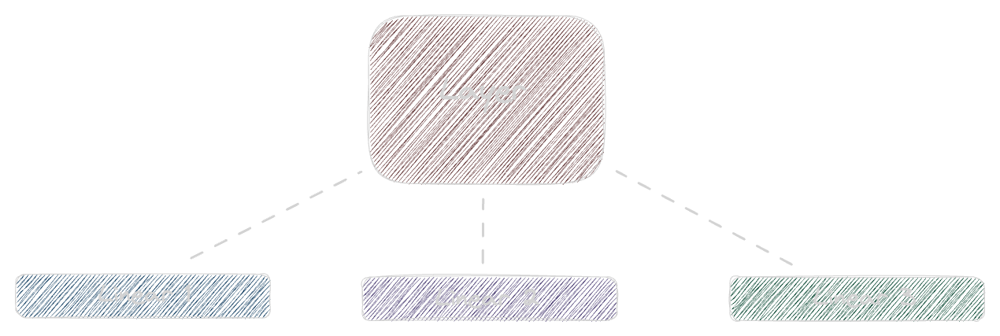
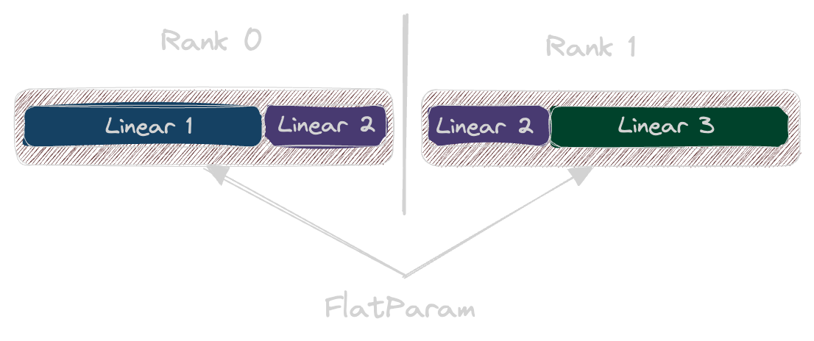
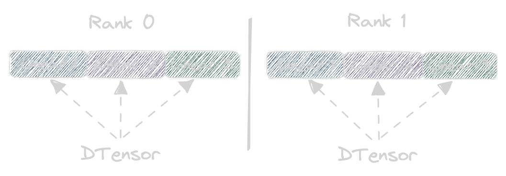

<!--Copyright 2025 The HuggingFace Team. All rights reserved.

Licensed under the Apache License, Version 2.0 (the "License"); you may not use this file except in compliance with
the License. You may obtain a copy of the License at

http://www.apache.org/licenses/LICENSE-2.0

Unless required by applicable law or agreed to in writing, software distributed under the License is distributed on
an "AS IS" BASIS, WITHOUT WARRANTIES OR CONDITIONS OF ANY KIND, either express or implied. See the License for the
specific language governing permissions and limitations under the License.

⚠️ Note that this file is in Markdown but contain specific syntax for our doc-builder (similar to MDX) that may not be
rendered properly in your Markdown viewer.
-->

# FSDP1 vs FSDP2

This guide explains the key differences between `FSDP1` and `FSDP2` and helps you migrate your existing code to use `FSDP2` with minimal changes.

## What is FSDP2?

`FSDP2` is a new and improved version of PyTorch's fully-sharded data parallel training API. Compared to `FSDP1`, it offers:
- Simpler internal implementation
- Simpler to partially freeze parameters
- Faster and simpler checkpointing without extra communication (`SHARDED_STATE_DICT`)
- With `DTensor`, `FSDP2` supports mixing `fp8` and other parameter types in the same model out of the box
- Future possibilities of optimizing communication patterns via `torch.compile`
- Memory efficiency and deterministic memory usage, `FSDP2` doesn't use `recordStream` anymore and uses stream-to-stream synchronization (for more technical details see [this forum post](https://dev-discuss.pytorch.org/t/fsdp-cudacachingallocator-an-outsider-newb-perspective/1486) and [this issue](https://github.com/pytorch/pytorch/issues/114299))

## How is it better than FSDP1?
The previous section shown what it offers, but how is it achieved?
In the following, we'll be discussing a scenario where we have a single `Layer` that contains 3 `Linear` layers and is sharded between 2 GPUs.



### FSDP1
First, we have to understand the original `FSDP1` and the limitations it brought.  It represented each `FSDP` module as a single `FlatParameter` which is a single 1D tensor that contains all the parameters of the module, it then gets sharded across GPUs. I.e. if you wrapped the `Layer` with `FSDP1`, you'd achieve something as such:



You might notice a problem. We flatten the whole `Layer` into a single `FlatParameter` which we then shard between GPUs. But if it's a single `FlatParameter`, how do we store metadata? That's the problem, we can't do it properly. We can't properly store `dtype` for each parameter, we can't properly store whether they're frozen or not, etc.

### FSDP2
This is why `FSDP2` was introduced. It doesn't use `FlatParameter`, instead it uses [`DTensor`](https://github.com/pytorch/pytorch/blob/main/torch/distributed/tensor/README.md) which is short for "Distributed Tensor". Each `DTensor` basically represent a vanilla `torch.Tensor` that has been sharded between GPUs. It contains metadata about the original `torch.Tensor` and how it's sharded, across which GPU and what is the [placement type](https://pytorch.org/docs/stable/distributed.tensor.html#module-torch.distributed.tensor.placement_types). How does this help us?



Each Parameter of the original `Layer` has been sharded across 0th dimension, and split between 2 GPUs. Now, each `Linear` layer is a separate `DTensor` and we can store metadata for each separately.


## API Differences

We have already discussed the internal differences, now let's discuss the differences, you, as a user, will need to know. 

Here are the main changes in configuration options when using `FSDP2` through the `Accelerate` CLI:

Previous (`FSDP1`) | New (`FSDP2`) | What Changed
-- | -- | --
`--fsdp_sharding_strategy` | `--fsdp_reshard_after_forward` | replaces `--fsdp_sharding_strategy`, changed to `true` (previously `FULL_SHARD`) or `false` (previously `SHARD_GRAD_OP`)
`--fsdp_backward_prefetch` | \*\***REMOVED**\*\* | `FSDP2` uses previous `BACKWARD_PRE` option by default, as only this allows communication and computation overlap
`--fsdp_state_dict_type` | \*\***REMOVED**\*\* | `FSDP2` always uses `SHARDED_STATE_DICT`, i.e. each rank only checkpoints the shard of the model on it, resulting in no extra communication
`--fsdp_forward_prefetch` | \*\***NOT YET IMPLEMENTED**\*\* | How to implement this is under active discussion, for now it is not supported in `FSDP2`
`--fsdp_sync_module_states` | \*\***REMOVED**\*\* | with `FSDP2`, this parameter becomes redundant
`--fsdp_cpu_ram_efficient_loading` | `--fsdp_cpu_ram_efficient_loading` | if `true`, `FSDP2` will similarly load the model only on rank 0, and then parameters get synced to other ranks, this is the same behavior as `FSDP1`, however, setting `--fsdp_sync_module_states` isn't required anymore
`--fsdp_state_dict_type` | `--fsdp_state_dict_type` | `LOCAL_STATE_DICT` becomes obsolete and with `FSDP2` `SHARDED_STATE_DICT` is the default option, which results in no extra communication and each rank saving its own shard, other possible option is `FULL_STATE_DICT` which results in extra communication and spike in memory usage but saves the full model from rank 0. `FULL_STATE_DICT` is not supported in `Accelerate` yet.
`--fsdp_use_orig_params` | \*\***REMOVED**\*\* | `FSDP2` uses a `DTensor` class on the background, which means it *always* uses the original parameters by default
\*\***NEW**\*\* | `--fsdp_version` | `2` is the default option, which means `FSDP2` is enabled by default, `FSDP1` can be selected by setting this to `1`

For all other options that remain unchanged, see the [`FSDP` documentation](../usage_guides/fsdp.md).

## How to Switch to FSDP2

### If using Python code:
Simply set `fsdp_version=2` when creating your plugin and replace options according to the table above.

```python
from accelerate import FullyShardedDataParallelPlugin, Accelerator

fsdp_plugin = FullyShardedDataParallelPlugin(
    fsdp_version=2
    # other options...
)
accelerator = Accelerator(fsdp_plugin=fsdp_plugin)
```

### If using YAML config:
Use our conversion tool:
```bash
accelerate to-fsdp2 --config_file config.yaml --output_file new_config.yaml
```

This will automatically convert all FSDP1 settings to their FSDP2 equivalents. Use `--overwrite` to update the existing file instead of creating a new one.
