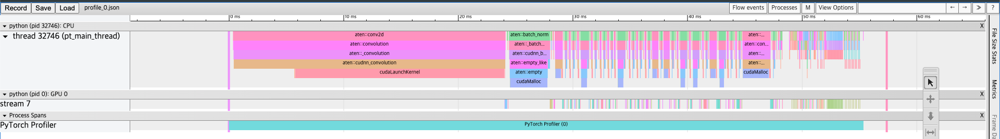

<!--
Copyright 2024 The HuggingFace Team. All rights reserved.

Licensed under the Apache License, Version 2.0 (the "License"); you may not use this file except in compliance with
the License. You may obtain a copy of the License at

http://www.apache.org/licenses/LICENSE-2.0

Unless required by applicable law or agreed to in writing, software distributed under the License is distributed on
an "AS IS" BASIS, WITHOUT WARRANTIES OR CONDITIONS OF ANY KIND, either express or implied. See the License for the
specific language governing permissions and limitations under the License.

⚠️ Note that this file is in Markdown but contains specific syntax for our doc-builder (similar to MDX) that may not be
rendered properly in your Markdown viewer.
-->

# Profiler

Profiler is a tool that allows the collection of performance metrics during training and inference. Profiler’s context manager API can be used to better understand what model operators are the most expensive, examine their input shapes and stack traces, study device kernel activity, and visualize the execution trace. It provides insights into the performance of your model, allowing you to optimize and improve it.

This guide explains how to use PyTorch Profiler to measure the time and memory consumption of the model’s operators and how to integrate this with 🤗 Accelerate. We will cover various use cases and provide examples for each.

## Using profiler to analyze execution time

Profiler allows one to check which operators were called during the execution of a code range wrapped with a profiler context manager.

Let’s see how we can use profiler to analyze the execution time:

<hfoptions id="cpu execution time">
<hfoption id="PyTorch">

```python
import torch
import torchvision.models as models
from torch.profiler import profile, record_function, ProfilerActivity

model = models.resnet18()
inputs = torch.randn(5, 3, 224, 224)

with profile(activities=[ProfilerActivity.CPU], record_shapes=True) as prof:
    model(inputs)

print(prof.key_averages().table(sort_by="cpu_time_total", row_limit=10))
```

</hfoption>
<hfoption id="Accelerate">

```python
from accelerate import Accelerator, ProfileKwargs
import torch
import torchvision.models as models

model = models.resnet18()
inputs = torch.randn(5, 3, 224, 224)

profile_kwargs = ProfileKwargs(
    activities=["cpu"],
    record_shapes=True
)

accelerator = Accelerator(cpu=True, kwargs_handlers=[profile_kwargs])
model = accelerator.prepare(model)

with accelerator.profile() as prof:
    with torch.no_grad():
        model(inputs)

print(prof.key_averages().table(sort_by="cpu_time_total", row_limit=10))
```

</hfoption>
</hfoptions>

The resulting table output (omitting some columns):

```
---------------------------------  ------------  ------------  ------------  ------------  
                             Name      Self CPU     CPU total  CPU time avg    # of Calls  
---------------------------------  ------------  ------------  ------------  ------------  
                     aten::conv2d     171.000us      52.260ms       2.613ms            20  
                aten::convolution     227.000us      52.089ms       2.604ms            20  
               aten::_convolution     270.000us      51.862ms       2.593ms            20  
         aten::mkldnn_convolution      51.273ms      51.592ms       2.580ms            20  
                 aten::batch_norm     118.000us       7.059ms     352.950us            20  
     aten::_batch_norm_impl_index     315.000us       6.941ms     347.050us            20  
          aten::native_batch_norm       6.305ms       6.599ms     329.950us            20  
                 aten::max_pool2d      40.000us       4.008ms       4.008ms             1  
    aten::max_pool2d_with_indices       3.968ms       3.968ms       3.968ms             1  
                       aten::add_     780.000us     780.000us      27.857us            28  
---------------------------------  ------------  ------------  ------------  ------------  
Self CPU time total: 67.016ms
```

To get a finer granularity of results and include operator input shapes, pass `group_by_input_shape=True` (note: this requires running the profiler with `record_shapes=True`):

```python
print(prof.key_averages(group_by_input_shape=True).table(sort_by="cpu_time_total", row_limit=10))
```

## Using profiler to analyze memory consumption

Profiler can also show the amount of memory (used by the model’s tensors) that was allocated (or released) during the execution of the model’s operators. To enable memory profiling functionality pass `profile_memory=True`.

<hfoptions id="memory consumption">
<hfoption id="PyTorch">

```python
model = models.resnet18()
inputs = torch.randn(5, 3, 224, 224)

with profile(activities=[ProfilerActivity.CPU],
        profile_memory=True, record_shapes=True) as prof:
    model(inputs)

print(prof.key_averages().table(sort_by="self_cpu_memory_usage", row_limit=10))
```

</hfoption>
<hfoption id="Accelerate">

```python
model = models.resnet18()
inputs = torch.randn(5, 3, 224, 224)

profile_kwargs = ProfileKwargs(
    activities=["cpu"],
    profile_memory=True,
    record_shapes=True
)

accelerator = Accelerator(cpu=True, kwargs_handlers=[profile_kwargs])
model = accelerator.prepare(model)

with accelerator.profile() as prof:
    model(inputs)

print(prof.key_averages().table(sort_by="self_cpu_memory_usage", row_limit=10))
```

The resulting table output (omitting some columns):

```
---------------------------------  ------------  ------------  ------------  
                             Name       CPU Mem  Self CPU Mem    # of Calls  
---------------------------------  ------------  ------------  ------------  
                      aten::empty      94.85 Mb      94.85 Mb           205  
    aten::max_pool2d_with_indices      11.48 Mb      11.48 Mb             1  
                      aten::addmm      19.53 Kb      19.53 Kb             1  
                       aten::mean      10.00 Kb      10.00 Kb             1  
              aten::empty_strided         492 b         492 b             5  
                        aten::cat         240 b         240 b             6  
                        aten::abs         480 b         240 b             4  
              aten::masked_select         120 b         112 b             1  
                         aten::ne          61 b          53 b             3  
                         aten::eq          30 b          30 b             1  
---------------------------------  ------------  ------------  ------------  
Self CPU time total: 69.332ms
```

</hfoption>
</hfoptions>


## Exporting chrome trace

You can examine the sequence of profiled operators and CUDA kernels in Chrome trace viewer (`chrome://tracing`):



<hfoptions id="exporting chrome trace">
<hfoption id="PyTorch">

```python
model = models.resnet18().cuda()
inputs = torch.randn(5, 3, 224, 224).cuda()

with profile(activities=[ProfilerActivity.CPU, ProfilerActivity.CUDA]) as prof:
    model(inputs)

prof.export_chrome_trace("trace.json")
```

</hfoption>
<hfoption id="Accelerate">

```python
profile_kwargs = ProfileKwargs(
    activities=["cpu", "cuda"],
    output_trace_dir="trace"
)

accelerator = Accelerator(kwargs_handlers=[profile_kwargs])
model = accelerator.prepare(model)

with accelerator.profile() as prof:
    model(inputs)

# The trace will be saved to the specified directory
```

</hfoption>
</hfoptions>

## Using Profiler to Analyze Long-Running Jobs

Profiler offers an additional API to handle long-running jobs (such as training loops). Tracing all of the execution can be slow and result in very large trace files. To avoid this, use optional arguments:

- `schedule_option`: Scheduling options allow you to control when profiling is active. This is useful for long-running jobs to avoid collecting too much data. Available keys are `wait`, `warmup`, `active`, `repeat` and `skip_first`. The profiler will skip the first `skip_first` steps, then wait for `wait` steps, then do the warmup for the next `warmup` steps, then do the active recording for the next `active` steps and then repeat the cycle starting with `wait` steps. The optional number of cycles is specified with the `repeat` parameter, the zero value means that the cycles will continue until the profiling is finished.
- `on_trace_ready`: specifies a function that takes a reference to the profiler as an input and is called by the profiler each time the new trace is ready.

To illustrate how the API works, consider the following example:

<hfoptions id="custom handler">
<hfoption id="PyTorch">

```python
from torch.profiler import schedule

my_schedule = schedule(
    skip_first=10,
    wait=5,
    warmup=1,
    active=3,
    repeat=2
)

def trace_handler(p):
    output = p.key_averages().table(sort_by="self_cuda_time_total", row_limit=10)
    print(output)
    p.export_chrome_trace("/tmp/trace_" + str(p.step_num) + ".json")

with profile(
    activities=[ProfilerActivity.CPU, ProfilerActivity.CUDA],
    schedule=my_schedule,
    on_trace_ready=trace_handler
) as p:
    for idx in range(8):
        model(inputs)
        p.step()
```

</hfoption>
<hfoption id="Accelerate">

```python
def trace_handler(p):
    output = p.key_averages().table(sort_by="self_cuda_time_total", row_limit=10)
    print(output)
    p.export_chrome_trace("/tmp/trace_" + str(p.step_num) + ".json")

profile_kwargs = ProfileKwargs(
    activities=["cpu", "cuda"],
    schedule_option={"wait": 5, "warmup": 1, "active": 3, "repeat": 2, "skip_first": 10},
    on_trace_ready=trace_handler
)

accelerator = Accelerator(kwargs_handlers=[profile_kwargs])
model = accelerator.prepare(model)

with accelerator.profile() as prof:
    for idx in range(8):
        model(inputs)
        prof.step()
```

</hfoption>
</hfoptions>

## FLOPS

Use formula to estimate the FLOPs (floating point operations) of specific operators (matrix multiplication and 2D convolution).

To measure floating-point operations (FLOPS):

<hfoptions id="FLOPS">
<hfoption id="PyTorch">

```python
with profile(
    activities=[ProfilerActivity.CPU, ProfilerActivity.CUDA],
    with_flops=True
) as prof:
    model(inputs)

print(prof.key_averages().table(sort_by="flops", row_limit=10))
```

</hfoption>
<hfoption id="Accelerate">

```python
profile_kwargs = ProfileKwargs(
    with_flops=True
)
accelerator = Accelerator(kwargs_handlers=[profile_kwargs])

with accelerator.profile() as prof:
    model(inputs)

print(prof.key_averages().table(sort_by="flops", row_limit=10))
```

The resulting table output (omitting some columns):

```
-------------------------------------------------------  ------------  ------------  ------------  
                                                   Name      Self CPU     Self CUDA    Total FLOPs  
-------------------------------------------------------  ------------  ------------  ------------  
                                           aten::conv2d     197.000us       0.000us  18135613440.000  
                                            aten::addmm     103.000us      17.000us     5120000.000  
                                              aten::mul      29.000us       2.000us          30.000  
                                      aten::convolution     409.000us       0.000us            --  
                                     aten::_convolution     253.000us       0.000us            --  
                                aten::cudnn_convolution       5.465ms       2.970ms            --  
                                        cudaEventRecord     138.000us       0.000us            --  
                                  cudaStreamIsCapturing      43.000us       0.000us            --  
                                  cudaStreamGetPriority      40.000us       0.000us            --  
                       cudaDeviceGetStreamPriorityRange      10.000us       0.000us            --  
-------------------------------------------------------  ------------  ------------  ------------  
Self CPU time total: 21.938ms
Self CUDA time total: 4.165ms
```

</hfoption>
</hfoptions>

## Conclusion and Further Information

PyTorch Profiler is a powerful tool for analyzing the performance of your models. By integrating it with 🤗 Accelerate, you can easily profile your models and gain insights into their performance, helping you to optimize and improve them.

For more detailed information, refer to the [PyTorch Profiler documentation](https://pytorch.org/docs/stable/profiler.html).